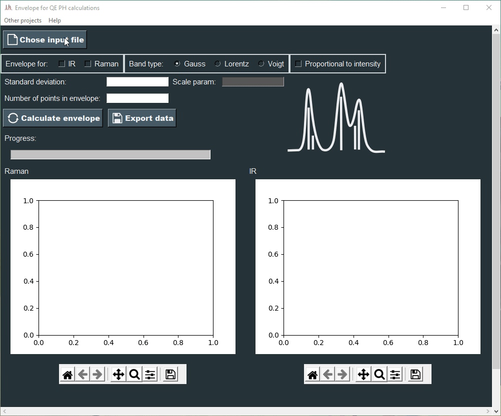
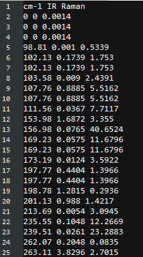

# Envelope for QE PH calculations

## Description

The application generates envelopes for intensities of the calculated theoretical spectra of IR and Raman. You can generate an envelope for a output from dynmat.x ( [Quantum espresso](https://www.quantum-espresso.org/)) or appropriate '.txt' file.

## Usage

If you want to use exe file for windows download "Envelope for QE PH calculations.zip" (find it in Releases) and unpack it. Run program "Envelope for QE PH calculations.exe" in unpacked folder. Complete the form and press `<Calculate envelope>` button to calculate envelope.

### Input files

You can use dynamt.x output or '.txt'. If you want use dynamt.x output don't add '.txt' extension. If file have '.txt' extension its format should be as shown in the picture. The file should contain 'Raman', 'cm-1' and 'IR' column labels.

If only one spectra is used two columns are needed 'cm-1' and 'IR' or 'Raman'.

### Types of bands 

- Gauss - Gaussian curve of single band
- Lorentz - Cauchy curve (Lorentz) of single band
- Voigt - Voigt curve of single band

Proportional to intensity option causes standard deviation and scale param are proportional to intensity. Only the greatest intensity has the entered values of standard deviation and scale param. These values decrease with intensity.

To obtain accurate envelopes number of points in envelope must be greater than 500.

### Export data

Calculated envelopes can be exported to '.csv' file.

## Technologies/Tools

1. Python 3.9
2. tkinter
3. Python Standard Library modules
4. Matplotlib
5. Numpy
6. SciPy
7. Pandas

## Tests

### Tools:

1. Appium-Python-Client 1.3 + WinAppDriver 1.2.1
2. pytest 
3. allure 

## How cite 
If you would like to cite the program in your work. The information below is provided.

### Script was written by Paweł Goj and first used in: 

1.	Goj, P., Handke, B. & Stoch, P. Vibrational characteristics of aluminum–phosphate compounds by an experimental and theoretical approach. Sci. Rep. 12, 17495 (2022) doi:10.1038/s41598-022-22432-5.

### The script uses the SciPy library: 

2.	Virtanen, P. et al. SciPy 1.0: fundamental algorithms for scientific computing in Python. Nat. Methods 17, 261–272 (2020) doi:10.1038/s41592-019-0686-2.
